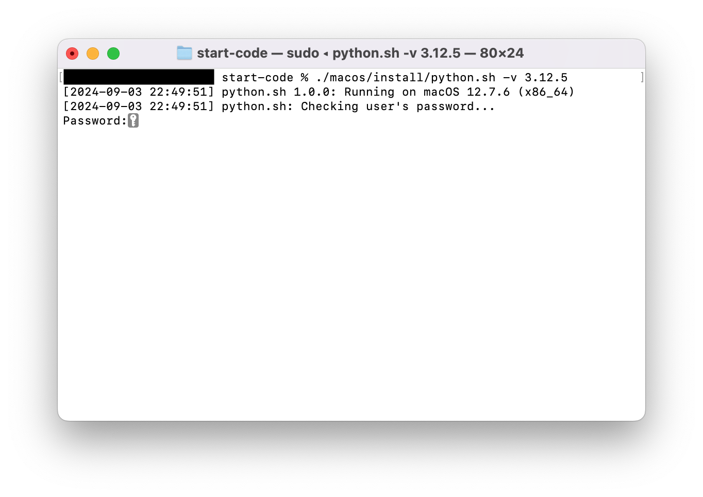

&emsp;


# start-code
これからプログラミングを始める方が、素早く開発環境を構築するための、セットアップスクリプト集です。  
Shell scripts to setup build and runtime environments with version control tools for a starter.

Here is English version of [README](./README_en.md).

## 背景
現在では、複数アプリケーションを並行開発できるように、1台の開発マシンに複数バージョンの開発・実行環境をインストールし、アプリケーションごとに切り替えて使用することが常識的です。

また、アプリケーションで使用する外部ライブラリであるパッケージも、ローカルなアプリケーション（プロジェクト）の領域で管理すべきで、グローバルな開発・実行環境の領域にインストールすべきではありません。

これら2点を実現するため、言語ごとにバージョン管理ツールやパッケージ管理ツールが提供されていますが、複数ツールを導入するのが手間だったり、パッケージ依存関係の問題がしばしば発生したりと、必ずしもセットアップが容易とは言えませんでした。

こうした理由から、手軽にこれらツールをセットアップでき、素早くプログラミングが始められるスクリプトを作成しました。

## システム要件
現時点で、動作確認を行なっているプラットフォームはmacOSのみです。

表1: 対象プラットフォーム
| プラットフォーム | CPUアーキテクチャー | OSバージョン | シェル |
| :--- | :--- | :--- | :--- |
| macOS | <ul><li>x86_64 (Intel Chip)</li><li>ARM64 (Apple Silicon)</li></ul> | <ul><li>Ventura (13)</li><li>Sonoma (14)</li><li>Sequoia (15)</li></ul> | zsh |

## プログラミング言語
現時点で、本スクリプトが対象としているプログラミング言語は、Ansible, JavaScript, Pythonです。

各言語のバージョン管理ツール、パッケージ管理ツールは次の通りです。バージョン管理ツールは、言語ごとに標準的なものを1つ選択しています。

表2: 対象プログラミング言語
| 言語 | バージョン管理ツール | 実行環境バージョン | デフォルトバージョン | パッケージ管理ツール |
| :--- | :--- | :--- | :--- | :--- |
| Ansible | venv | 2.17, 2.18 | 2.17.11 | ansible-galaxy |
| JavaScript | nvm | Node.js 20, 22, 23 | 22.15.0 | npm |
| Python | pyenv | 3.9.1以上, 3.10, 3.11, 3.12, 3.13 | 3.12.10 | <ul><li>venv+pip</li><li>Pipenv</li><li>Poetry</li></ul> |

## 実行方法
まず最初に、macOSのターミナルを開き、本リポジトリをクローンします。
```sh
git clone https://github.com/hotani3/start-code.git
```

まだgitコマンドがインストール済みでないときは、[Releases](https://github.com/hotani3/start-code/releases)からZIPファイルをダウンロードし、展開します。
```sh
unzip start-code-1.1.2.zip && mv start-code-1.1.2 start-code
```

次に、クローンまたはZIP展開したディレクトリに移動します。
```sh
cd start-code
```

そして、各言語のセットアップスクリプトを実行します。  
スクリプトは必ず、「start-code」ディレクトリにいる状態で実行してください。

`-v`オプションで開発・実行環境バージョンが指定可能です。  
指定しなかった場合は、表2のデフォルトバージョンがインストールされます。

#### Ansible
```sh
./macos/install/ansible.sh -v 2.17.11
```

#### JavaScript
```sh
./macos/install/javascript-node.sh -v 22.15.0
```

JavaScriptでは、`-v`オプションはNode.js実行環境のバージョンです。  
バージョン番号に加えて、`stable`（安定版最新）, `'lts/*'`（LTS版最新）, `lts/iron`（LTS20系最新）, `lts/jod`（LTS22系最新）といったエイリアス（別名）指定も可能です。

#### Python
```sh
./macos/install/python.sh -v 3.12.10
```

スクリプト実行直後、次のようにパスワード入力を促されたときは、Macログインユーザーのパスワードを入力してください。



しばらく待ち、ターミナルに以下のようなログが出力されれば、開発・実行環境のインストールに成功しています。
```sh
[2024-09-03 22:57:35] INFO python.sh: Successfully installed Python!
[2024-09-03 22:57:36] INFO python.sh: Detected Python 3.12.10
```

Python標準のvenv+pipではなく、PipenvやPoetryでパッケージ管理を行う場合は、`python.sh`の代わりに、次のスクリプトを実行してください。

#### Pipenv
```sh
./macos/install/python-pipenv.sh -v 3.12.10
```

#### Poetry
```sh
./macos/install/python-poetry.sh -v 3.12.10
```

上記の例では、Python 3.12.10がインストールされ、さらにPipenvまたはPoetryがインストールされます。  
いずれの場合も、`-v`オプションはPython実行環境のバージョンです。PipenvやPoetryのバージョンではないことに注意してください。

なお、Pipenvは`-v`で指定されたバージョンに加えて、`pyenv global`で指定された現在選択中のバージョンにもインストールされます。

**スクリプト実行後、ターミナルで新規ウィンドウまたは新規タブを開くか、もしくは現在のターミナルで次のように`.zshrc`の再読み込みを行うと、各ツールが使えるようになります。**
```sh
source ~/.zshrc
```

最後に、バージョン管理ツールでインストールされたバージョン、および、現在選択中のバージョンを確認することをお勧めします。
#### Ansible
```sh
ls ~/envs
```

初めてAnsible実行環境をインストールしたときの表示例です。
```sh
ansible-2.17.11
```

インストールしたバージョンを選択して使用する方法については、[ansible.md](./docs/ansible.md)をご覧ください。

#### JavaScript
```sh
nvm ls
```

初めてNode.js実行環境をインストールしたときの表示例です。
```sh
->     v22.15.0
         system
default -> 22.15.0 (-> v22.15.0)
[後略]
```

#### Python
```sh
pyenv versions
```

初めてPython実行環境をインストールしたときの表示例です。
```sh
  system
* 3.12.10 (set by /Users/username/.pyenv/version)
```

## 補足説明：追加・更新されるパッケージと設定ファイル
本スクリプトを実行すると、バージョン管理ツール、開発・実行環境、パッケージ管理ツールの動作のため、必要に応じて以下のパッケージが自動でダウンロード、インストールされます。

加えて、環境変数やプログラム実行パスの設定を行うため、必要に応じて以下の設定ファイルも自動更新されます。

表3: 追加・更新対象のパッケージ・設定ファイル
| プラットフォーム | パッケージ | 設定ファイル |
| :--- | :--- | :--- |
| macOS | <ul><li>Xcode Command Line Tools</li><li>Homebrew</li><li>XZ Utils</li></ul> | <ul><li>\~/.zprofile</li><li>\~/.zshrc</li></ul> |

このため、各ツールの動作に必要なパッケージの手動インストールや、環境変数の手動設定は不要です。

## 参考情報
#### JavaScript
- [nvm(Node Version Manager)を使ってNode.jsをインストールする手順](https://qiita.com/ffggss/items/94f1c4c5d311db2ec71a)

#### Python
- [pyenv, virtualenv, pipenv, poetry の概要](https://blog.serverworks.co.jp/pyenv-virtualenv-pipenv-poetry)
- [Pipenvを使ったPython開発まとめ](https://qiita.com/y-tsutsu/items/54c10e0b2c6b565c887a)
- [Poetryをサクッと使い始めてみる](https://qiita.com/ksato9700/items/b893cf1db83605898d8a)