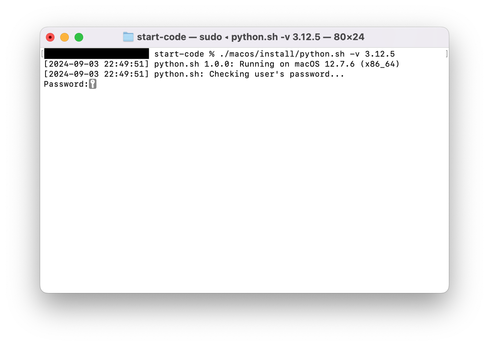

&emsp;


# start-code
Shell scripts to setup build and runtime environments with version control tools for a starter.  
これからプログラミングを始める方が、素早く開発環境を構築するための、セットアップスクリプト集です。

こちらに、日本語バージョンの[README](./README.md)があります。

## Background
Nowadays, it is common to install multiple versions of development and runtime environments on a single development machine so that multiple applications can be developed in parallel, and switch between them as needed.

Also, external libraries (packages) used by applications should be managed within the local application (project) scope, rather than being installed in the global development or runtime environment.

To achieve these two points, version control tools and package management tools are provided for each language, but it has not always been easy to set them up due to the hassle of installing multiple tools and the frequent occurrence of package dependency issues.

For these reasons, I created these scripts that allows you to easily set up these tools and start programming quickly.

## System Requirements
Currently, the only platform that has been tested is macOS.

Table 1: Target Platforms
| Platform | CPU Architecture | OS Version | Shell |
| :--- | :--- | :--- | :--- |
| macOS | <ul><li>x86_64 (Intel Chip)</li><li>ARM64 (Apple Silicon)</li></ul> | <ul><li>Ventura (13)</li><li>Sonoma (14)</li><li>Sequoia (15)</li></ul> | zsh |

## Programming Language
At present, these scripts are targeted for JavaScript and Python.

The version control tool and package management tools for each language are as follows. One standard version control tool has been chosen for each language.

Table 2: Target Programming Languages
| Language | Version Control Tool | Runtime Version | Default Version | Package Management Tool |
| :--- | :--- | :--- | :--- | :--- |
| Javascript | nvm | Node.js 20, 22, 23 | 22.12.0 | npm |
| Python | pyenv | 3.9.1 or higher, 3.10, 3.11, 3.12, 3.13 | 3.12.8 | <ul><li>venv+pip</li><li>Pipenv</li><li>Poetry</li></ul> |

## How to Execute
First, open the macOS terminal and clone this repository.
```sh
git clone https://github.com/hotani3/start-code.git
```

If the git command is not installed, download the ZIP file from [Releases](https://github.com/hotani3/start-code/releases) and extract it.
```sh
unzip start-code-1.1.2.zip && mv start-code-1.1.2 start-code
```

Next, move to the directory that was cloned or extracted from the ZIP.
```sh
cd start-code
```

Then, execute a setup script for each language.  
Be sure to run a script while you are in the "start-code" directory.

You can specify a development or runtime environment version with the `-v` option.  
If not specified, the default version in Table 2 will be installed.

#### JavaScript
```sh
./macos/install/javascript-node.sh -v 22.12.0
```

In JavaScript, the `-v` option is the version of the Node.js runtime environment.  
In addition to the version number, you can also specify aliases such as `stable` (latest stable version), `'lts/*'` (latest LTS version), `lts/iron` (latest of LTS 20 series), and `lts/jod` (latest of LTS 22 series).

#### Python
```sh
./macos/install/python.sh -v 3.12.8
```

Immediately after running the script, if you are prompted to enter a password as shown below, please enter your Mac login user's password.



Wait a moment, and if the following log is output to the terminal, a development or runtime environment has been successfully installed.
```sh
[2024-09-03 22:57:35] INFO python.sh: Successfully installed Python!
[2024-09-03 22:57:36] INFO python.sh: Detected Python 3.12.8
```

If you want to manage packages with Pipenv or Poetry instead of Python's standard venv+pip, run the following script instead of `python.sh`.

#### Pipenv
```sh
./macos/install/python-pipenv.sh -v 3.12.8
```

#### Poetry
```sh
./macos/install/python-poetry.sh -v 3.12.8
```

In the above examples, Python 3.12.8 will be installed, and additionally, Pipenv or Poetry will also be installed.  
In all cases, the `-v` option is for specifying the Python runtime environment version, not the version of Pipenv or Poetry.

Please note that for Pipenv, it will be installed for both the version specified with `-v` and the currently selected version as specified by `pyenv global`.

**After the script has finished running, open a new window or tab in the terminal, or reload `.zshrc` in the current terminal as shown below to start using the tools.**

```sh
source ~/.zshrc
```

Finally, it is preferable to check the versions installed and currently selected with a version control tool.
#### JavaScript
```sh
nvm ls
```

Here is an example of what you see when you first install the Node.js runtime environment.
```sh
->     v22.12.0
         system
default -> 22.12.0 (-> v22.12.0)
[The rest is ommitted]
```

#### Python
```sh
pyenv versions
```

Here is an example of what you see when you first install the Python runtime environment.
```sh
  system
* 3.12.8 (set by /Users/username/.pyenv/version)
```

## Additional Notes: Packages and Configuration Files Added or Updated
When these scripts are executed, the following packages will be automatically downloaded and installed as necessary to ensure the operation of version control tools, development and runtime environments, and package management tools.

Additionally, the following configuration files will be automatically updated as necessary to configure environment variables and program execution paths.

Table 3: Packages and Configuration Files to be Added or Updated
| Platform | Package | Configuration File |
| :--- | :--- | :--- |
| macOS | <ul><li>Xcode Command Line Tools</li><li>Homebrew</li><li>XZ Utils</li></ul> | <ul><li>\~/.zprofile</li><li>\~/.zshrc</li></ul> |

Therefore, you don't have to install packages or set environment variables manually for each tool to work propery.

## Reference Information
#### JavaScript
- [Steps to install Node.js using nvm(Node Version Manager)](https://qiita.com/ffggss/items/94f1c4c5d311db2ec71a)

#### Python
- [Overview of pyenv, virtualenv, pipenv, poetry](https://blog.serverworks.co.jp/pyenv-virtualenv-pipenv-poetry)
- [Summary of Python development with Pipenv](https://qiita.com/y-tsutsu/items/54c10e0b2c6b565c887a)
- [Starting quickly with Poetry](https://qiita.com/ksato9700/items/b893cf1db83605898d8a)